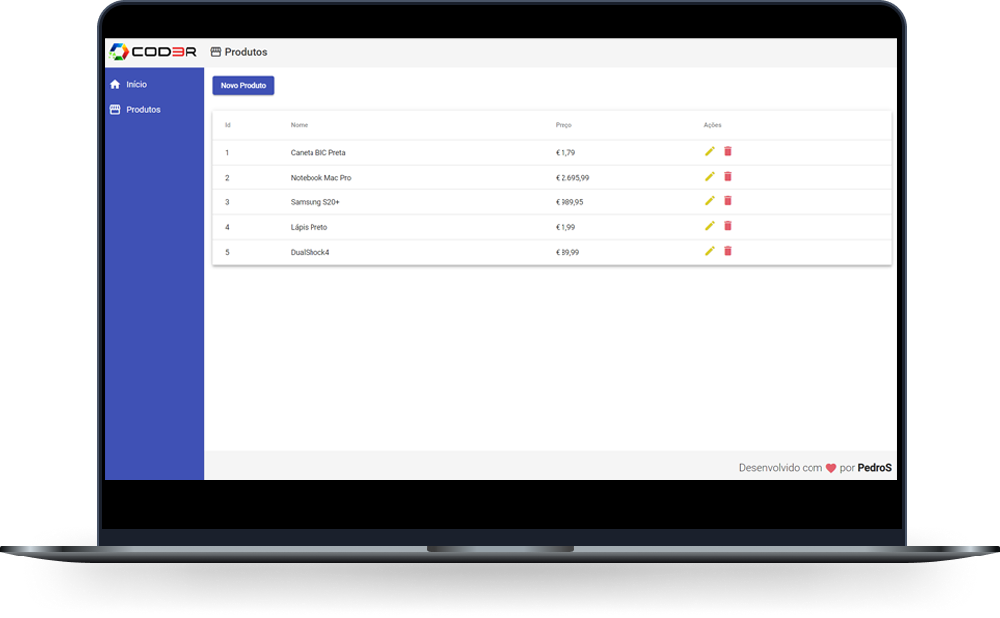

<h1 align="center">
  
</h1>

  <a href="#-tecnologias">Tecnologias</a>&nbsp;&nbsp;&nbsp;|&nbsp;&nbsp;&nbsp;
  <a href="#-projeto">Projeto</a>&nbsp;&nbsp;&nbsp;

 

  

## 🚀 Tecnologias

Esse projeto foi desenvolvido com as seguintes tecnologias:

- JSON Server
- Angular

## 💻 Projeto

Este projeto é um CRUD de produtos simples feito em Angular com um back-end com JSON Server.

## Como utilizar

Run `npm start` in 'backend/' to execute the JSON Server.

Run `ng serve -o` in 'frontend/' to execute the Angular.

## Curso

https://www.cod3r.com.br/courses/angular-9-essencial

---

Feito com ♥ by Pedro Santana
